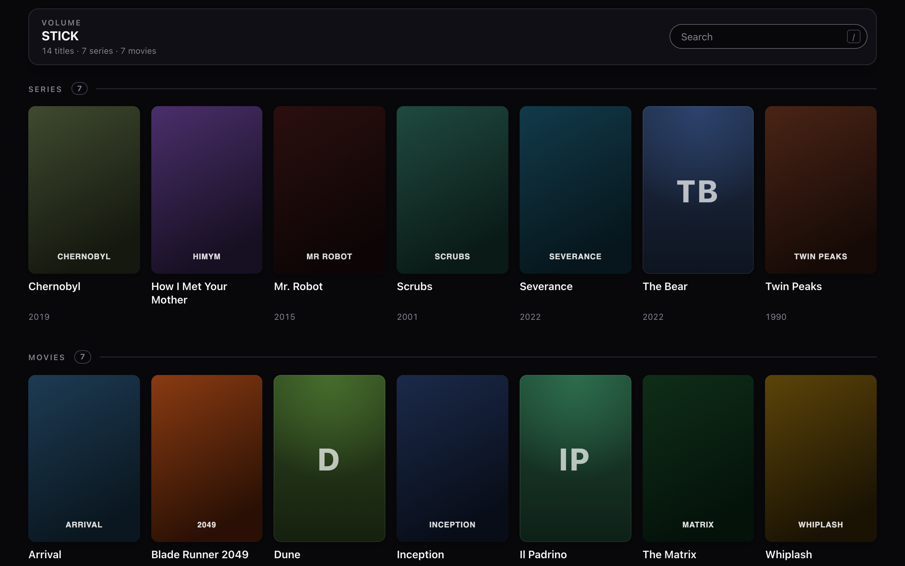
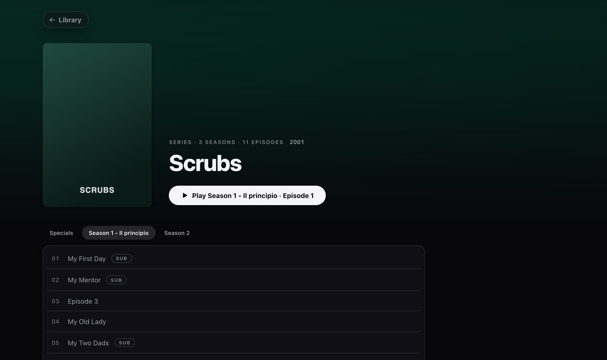
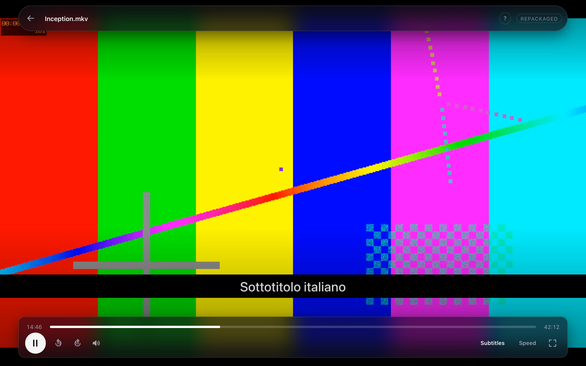

<div align="center">

<picture>
  <source media="(prefers-color-scheme: dark)" srcset=".github/logo-dark.svg">
  
</picture>

# ReelDrive

**Your film library on a USB stick. Unpack it, add a folder, no installation.**

No server, no account, no network, no configuration file. ReelDrive reads the
filesystem and works out on its own what is a film and what is a series.

[](https://github.com/IceWizard98/ReelDrive/actions/workflows/release.yml)
[](#platform-notes)
[](https://tauri.app)
[](https://svelte.dev)
[](https://www.rust-lang.org)
[](#development)
[](LICENSE)



</div>

---

## Why

Every other way to watch your own films asks for something first. A server to
keep running, a library to import, an account to sign in to, a network to be on.
ReelDrive asks for a folder.

Copy the app and a `media/` folder onto a stick and it is finished. Plug it into
any machine and everything you own is there — including the machine on the train
with no internet, and the one that has never heard of ffmpeg.

## Quick start

1. Download the archive for your platform from
   [Releases](https://github.com/IceWizard98/ReelDrive/releases).
2. Unpack it onto the stick. On Windows and Linux the archive holds three files,
   and all three have to stay in the same folder.
3. Create a folder named `media` beside the app, one subfolder per title.
4. Open the app.

What the stick holds, per platform:

```
macOS                    Windows                  Linux
/  (stick root)          /  (stick root)          /  (stick root)
├── ReelDrive.app/       ├── ReelDrive.exe        ├── ReelDrive.AppImage
│   (ffmpeg inside)      ├── ffmpeg.exe           ├── ffmpeg
│                        ├── ffprobe.exe          ├── ffprobe
└── media/               └── media/               └── media/
```

Only macOS keeps the tools out of sight, because a `.app` is a folder and
"inside the app" and "beside the app" are the same place. A `.exe` and an
AppImage are single files, so `ffmpeg` and `ffprobe` travel beside them: move
the app on its own and nothing plays.
[Why they cannot go in](#why-the-tools-cannot-go-inside-the-file).

The `media/` folder is yours to fill:

```
/  (stick root)
└── media/                      # fixed name, you create it
    ├── Scrubs/
    │   ├── cover.jpg           # optional
    │   ├── Season 1/           Scrubs S01E01 - My First Day.mkv …
    │   └── S02/                …
    ├── How I Met Your Mother/  # single season: episodes in the root
    │   └── HIMYM S01E01.mkv …
    └── Inception (2010)/       # a film: one video
        ├── Inception.mkv
        └── Inception.it.srt
```

If `media/` is missing the app says so and explains what to do. A title with no
cover gets a generated tile carrying its initials — that is the ordinary case,
not a fallback.

## Features

- **Reads what you already have.** No import step, no renaming, no metadata
  scraping. The folder names are the library.
- **Plays what the machine cannot.** `ffmpeg` travels with the app and steps
  in only when the format needs it — see [Playback](#playback).
- **Subtitles, embedded or beside the file.** Re-cut on every seek so they stay
  on the picture's clock, at a size that follows the picture.
- **More than one audio track**, chosen mid-film without restarting it.
- **Keyboard throughout**, including the grid — see [Keyboard](#keyboard).
- **Picks up where you left off**, including the next episode across the end of
  a season — see [Where you got to](#where-you-got-to). It travels with the
  stick, so it is the same on the next machine.
- **Nothing left behind.** Two hidden files inside `media/`, deletable at any
  time. Nothing is written anywhere else on the host.

<div align="center">

</div>

## How content is classified

One folder per title. Everything else is read from the names on disk.

| What the folder holds | How it is read |
| --- | --- |
| subfolders like `Season 1`, `S02`, `Stagione 3` | multi-season series |
| two or more videos in the root, no season folders | single-season series |
| one video carrying an `S01E01` marker | series with one episode |
| one video | film |
| no video | skipped, and reported on the home screen |

Every row of every table below is a real output of the parser, not an
illustration: the same cases are pinned by tests in
[`core/naming.rs`](src-tauri/src/core/naming.rs).

### Title and year, from the folder name

Dots and underscores become spaces, and everything from the year onwards is
dropped — which is what removes release tags without a list of them to match.

| Folder name | Title | Year |
| --- | --- | --- |
| `Inception (2010)` | Inception | 2010 |
| `Dune [2021]` | Dune | 2021 |
| `Amélie (2001)` | Amélie | 2001 |
| `The.Matrix.1999.1080p.BluRay.x264` | The Matrix | 1999 |
| `How_I_Met_Your_Mother` | How I Met Your Mother | — |
| `Scrubs` | Scrubs | — |
| `Blade Runner 2049` | Blade Runner 2049 | — |
| `Blade Runner 2049 (2017)` | Blade Runner 2049 | 2017 |
| `(2010)` | (2010) | — |

The last three are the rule worth knowing. **A year in brackets always counts. A
bare one only counts when something follows it**, so `2049` at the end of a name
belongs to the title — and when the two appear together, the bracketed one wins.
A name that is *only* a year is kept whole, because a title has to be called
something.

### Season, from the folder name

| Folder name | Season | Listed as |
| --- | --- | --- |
| `Season 1` | 1 | Season 1 |
| `S02` | 2 | Season 2 |
| `s3` | 3 | Season 3 |
| `Stagione 3` | 3 | Season 3 |
| `Season_4`, `Season.5` | 4, 5 | Season 4, Season 5 |
| `Season 1 - inizio` | 1 | **Season 1 - inizio** |
| `Stagione 2 — La vendetta` | 2 | **Stagione 2 — La vendetta** |
| `S03 - Finale` | 3 | **S03 - Finale** |
| `Specials`, `Extras`, `Bonus` | 0 | Specials, Extras, Bonus |
| `Prima Stagione`, `Parte 1` | by position | **Prima Stagione**, **Parte 1** |
| `S01E02`, `Season 1x02`, `Season 1080p` | not a season | — |

Two rules sit behind that:

**A label after the number is yours and is kept.** Nobody else knows what
`inizio` means, so replacing it with `Season 1` would be replacing information
with a guess. A folder that says nothing beyond its number gets the canonical
`Season N` instead, so `S02` and `stagione 2` do not read as two different
things.

**A marker glued to the number is not a season.** One alphanumeric character
touching the digits is the whole difference between `Season 1 - inizio` and
`S01E02`, which is a file's marker and must never become a folder of its own.

Folders the app does not recognise at all still become seasons if they hold
episodes — in natural order, keeping their names. A recognised season name
always wins over them.

### Season and episode, from the file name

Five forms, tried in this order. The first one found wins, so a file carrying
two markers is placed by the first.

| File name (without extension) | Season | Episode | Shown as |
| --- | --- | --- | --- |
| `Scrubs S01E02 - My Mentor` | 1 | 2 | My Mentor |
| `scrubs s1e2` | 1 | 2 | Episode 2 |
| `Show 1x03` | 1 | 3 | Episode 3 |
| `Episodio 6` | from the folder | 6 | Episode 6 |
| `Episode 4 - Titolo` | from the folder | 4 | Titolo |
| `Ep 04 - Title` | from the folder | 4 | Title |
| `E05` | from the folder | 5 | Episode 5 |
| `04 - Pilot` | from the folder | 4 | Pilot |
| `Show S01E02E03` | 1 | 2 | E03 |
| `Pilot` | — | by position | Pilot |

**The title is whatever follows the marker**, trimmed of dashes and dots. A file
that is only a marker has no title of its own and is listed as `Episode N`.

**Numbering falls back together, never halfway.** Markers are used only if every
file in the season has one; a single file without sends the whole season to
natural order (`ep2` before `ep10`), so two episodes can never claim the same
number.

### A series with no season folders

Episodes loose in the content folder are placed by their own markers. **You do
not need folders to get separate seasons** — the markers are enough, and no
season is invented to fill a gap between them.

| What the folder holds | What you get |
| --- | --- |
| `Show S01E01.mkv`<br>`Show S03E01.mkv` | **two seasons, 1 and 3.** No season 2, because nothing claims to be one |
| `Show S01E01.mkv`<br>`Show S01E02.mkv` | one season, 1, with episodes 1 and 2 |
| `E01.mkv`<br>`E02.mkv` | one season, 1 — the names give an episode but no season, and inventing more than one would be a guess |
| `Show 1x01.mkv`<br>`Show 2x01.mkv` | two seasons, 1 and 2 |
| `Show S01E01.mkv`<br>`Season 2/Show S02E01.mkv` | two seasons: the loose file makes season 1, the folder makes season 2 |
| `Pilot.mkv`<br>`Finale.mkv` | one season, numbered by natural order |

And when a folder and a file disagree, **the folder wins**:

| Path | Season | Episode |
| --- | --- | --- |
| `Season 4/Show S01E07.mkv` | **4**, from the folder | **7**, from the file |

The folder is the thing you arranged by hand, so it decides where the episode
belongs. The episode number is the part the folder cannot say, so that still
comes from the file.

### Subtitles and covers

| Kind | Matched by |
| --- | --- |
| Subtitles | `.srt` `.ass` `.ssa` `.sub` `.vtt` beside the video, sharing its name — `Inception.mkv` takes `Inception.srt` and `Inception.it.srt` |
| Covers | `cover`, `poster`, `folder`, `fanart`, `banner`, `thumb`, in that order; any other image in the folder is the fallback |

## Playback

Video plays in the window, in the webview's own `<video>` element, with `ffmpeg`
in front of the file only when the format needs it — the model Jellyfin uses.
The player says which of the four it is doing.

| Treatment | When | Cost |
| --- | --- | --- |
| **Direct** | the platform already decodes it | none — the file is served as it is, seekable over byte ranges |
| **Repackaged** | playable streams in a container the webview will not open | milliseconds, no re-encoding |
| **Audio converted** | AC3 or DTS sound, which no browser decodes | cheap |
| **Converted** | a video codec the platform cannot decode at all | the expensive path, used last |

Anything `ffmpeg` touches is delivered as HLS: a playlist of fragmented MP4
segments in a temporary folder, which is what WebKit will actually play — it
refuses a `<video>` served as an endless stream with no length and no ranges.
The playlist grows as `ffmpeg` writes, so seeking inside what has been produced
is native too; only a jump past it restarts the conversion there. WebKit reads
the playlist itself and `hls.js` covers the engines that do not.

Conversions are watched rather than fired and forgotten. If `ffmpeg` gives up
halfway, its own complaint reaches the screen instead of the picture simply
stopping.

<div align="center">

</div>

### ffmpeg travels with the app

Every release archive carries a static `ffmpeg` and `ffprobe`, so a stick works
on a machine that has never seen either. On macOS they live inside the bundle,
where tidying up the stick cannot separate them from the app; on Windows and
Linux they sit next to the executable. Failing that the launch folder is
searched, then `PATH`. **Without them nothing plays.**

A pair copied from a package manager is not a substitute: those are linked
against libraries that exist only on the machine that installed them.
`scripts/fetch-ffmpeg.sh` downloads the static builds the releases use, each
pinned to an immutable URL and checked against a recorded SHA256:

```sh
scripts/fetch-ffmpeg.sh macos-arm64 path/to/ReelDrive.app/Contents/MacOS
```

### Subtitles and audio

Embedded text tracks are extracted to WebVTT on demand. A restarted stream
begins at zero on the element's clock, so the tracks are re-cut to the same
offset — otherwise every line after the first seek is minutes out of place.

Bitmap tracks (PGS on Blu-ray rips, VobSub on DVD ones) are pictures, not text,
and cannot become WebVTT. The player says so in the subtitle menu rather than
silently offering nothing; a `.srt` beside the file works.

Cue size follows the height of the picture, so captions hold in full screen, and
the menu offers three sizes — one number is a guess about someone else's eyes
and someone else's screen.

A film with more than one audio track gets an Audio menu. Picking a language
rebuilds the stream from the same second, because only one track travels and the
element has no working way to choose between several once they have arrived. The
treatment is decided again for the track chosen: a second language is often in a
codec the first one is not.

### Keyboard

| Key | Does |
| --- | --- |
| `Space` · `K` | play or pause |
| `←` `→` | 5 seconds |
| `J` · `L` | 10 seconds |
| `↑` `↓` | volume |
| `M` | mute |
| `C` | subtitles |
| `F` | full screen |
| `N` | next episode — only when there is one, so never on a film |
| `?` | the list of these |
| `Esc` | leave full screen, then leave the film |

In the library, `/` jumps to the search field and the arrow keys walk the grid
by position — `Home` and `End` reach the ends.

## Development

```sh
npm install
REELDRIVE_MEDIA=/path/to/media npm run tauri dev

just test      # or: make test    — 295 Rust, 150 frontend
just check     # or: make check   — tests, clippy, formatting, frontend build
```

`REELDRIVE_MEDIA` exists for development only, because under `tauri dev` the
executable lives in `target/debug/`. A released build always looks for `media/`
next to itself and nowhere else.

The Rust tests cover the decisions — classification, delivery, path validation,
the arguments handed to ffmpeg — against in-memory trees and fake tools. The
frontend tests cover the player and the grid: which menus appear, what a chosen
audio track asks the backend for, what a cover-less folder falls back to.

**`http://localhost:1420/preview.html`** runs the real interface against stub
data in a plain browser, which is how the design is worked on and screenshotted
without building the app. A hash opens a title directly and `!` adds steps:
`preview.html#Scrubs`, `preview.html#Inception!play!at0.35`.

Five examples answer what the tests cannot, because they use real files and real
tools:

```sh
cd src-tauri
cargo run --example scan   -- /path/to/media          # what the app would read
cargo run --example tools  --                         # where ffmpeg is found
cargo run --example stream -- /path/to/film.mkv 300   # what a conversion makes
cargo run --example serve  -- /path/to/media "Film/Film.mkv"
```

`serve` follows the playlist rather than fetching it once: a single fetch says a
conversion started and nothing about whether it finishes.

### Architecture

Hexagonal, so the rules can be tested against in-memory trees rather than real
sticks:

```
src-tauri/src/
├── core/        model, filename parsing, scanner, path validation
│                — no std::fs, no ffmpeg, no Tauri
├── ports/       the FileSystem and LibraryCache traits
├── adapters/    std::fs, the JSON cache, ffmpeg,
│                and the loopback HTTP server that feeds <video>
├── defaults.rs  every convention in one place
└── lib.rs       the Tauri commands and startup
```

The frontend mirrors it: `src/lib/api.js` is the only file that knows Tauri
exists, and every component is given data rather than fetching it.

### Building

Nothing is linked in — the app talks to ffmpeg as a process — so the build needs
no media libraries.

```sh
just build                     # leaves it in src-tauri/target/release
just build /Volumes/STICK      # and copies it onto the stick
```

`make build` and `make build DEST=/Volumes/STICK` do the same.

The build always finishes the app **where it is made**: the binary plus the two
tools beside it. What sits under `src-tauri/target/release` is already the whole
product, and that is what to open while working on it. A destination is for the
stick.

The three binaries **cannot be built from one machine**: each needs its own
platform's webview toolchain, and cross-compiling is not practical. Publishing a
release builds on four runners — macOS arm64, macOS Intel, Windows, Linux — and
attaches the archives to it. To rehearse, run the workflow manually from Actions
with an empty tag: it builds and uploads artifacts without touching any release.

Each archive carries its platform's static tools, which is what makes the macOS
archives around 130 MB. To move to a newer ffmpeg, replace the URL and its
checksum in `scripts/fetch-ffmpeg.sh` — the two are meant to change together.

### The index cache

The scan is remembered in `media/.reeldrive-cache.json`, hidden, so a full stick
opens at once instead of being walked again. It is an optimisation and never a
source of truth: missing, unreadable or outdated all mean the same thing — scan
again. On read-only media the app still works, it just rescans every time.

Every binary carries a build number, and a cache written by any other build is
discarded. That is deliberately blunter than it needs to be: bumping a format
version by hand is exactly the step that gets forgotten, and a cache read back
into a shape that no longer means the same thing is a bug nobody can see. The
cost is one walk of the stick after each update.

Anything unreadable is **deleted**, not merely ignored, along with cache files
left under names earlier releases used. Otherwise every rename and every format
change would leave one more hidden file on your stick for good.

## Where you got to

Stop a film and it opens there next time. Finish an episode and the next one
starts by itself, including when the next one is in the following season — the
press this app used to be missing.

The library marks what has been started, with a bar across the poster and a
**Continue watching** row above the grid; the episode list ticks what has been
watched and shows how far an unfinished one got. The button on a title becomes
**Resume**, and it names the episode, because where you got to may be in a
season the tabs are not showing.

| | |
| --- | --- |
| Remembered after | 15 seconds, so a file opened by mistake is not "started" — or a twentieth of the running time, whichever comes first, so short files are not walled out |
| Counted as finished when | only the credits are left: two minutes, or 5% of the running time if that is longer, and never before four fifths of a short file |
| What is stored | one line per video: the position, the length, and when |
| Where "next" comes from | the seasons, walked in order, first one not finished |

Both rules are lengths of time before they are percentages, because that is
what they describe. Fifteen seconds is a moment of a film and the whole of a
clip; closing credits run for minutes whatever the running time is. A twentieth
of a twenty-minute episode is one minute — shorter than the outro of every anime
ever made, so the viewer stops when the song starts and the episode stays
unwatched for ever.

| Running time | Started after | Finished at | Credits allowed |
| --- | --- | --- | --- |
| 4 seconds | 0.2s | 80% | — |
| 1 minute | 3s | 80% | 12s |
| 20 minutes | 15s | 18:00 | 2:00 |
| 40 minutes | 15s | 38:00 | 2:00 |
| 45 minutes | 15s | 42:45 | 2:15 |
| 2 hours | 15s | 1:54:00 | 6:00 |

The two allowances meet at forty minutes, where 5% of the running time is
exactly the two minutes, which is why anything longer behaves exactly as a flat
95% always did. Below ten minutes the four-fifths floor is what applies, because
two minutes of credits is more than a fifth of the film.

**"Where do I carry on" and "what comes after this" are two questions**, and the
app asks them in different places. The **Resume** button on a title asks the
first: the earliest episode not finished, which may be one you skipped past. The
skip button in the player, and the end of an episode, ask the second: the one
that follows this file in the running order, watched or not. Answering the
second with the first is how an evening could run backwards — finish episode
two of a series whose first episode you never opened, and "the earliest not
finished" is episode one.

**Nothing remembers which episode you are on.** It is worked out each time from
the folders and the history together, so renaming a folder or dropping in the
episodes you were missing cannot leave a pointer quietly aiming at the wrong
thing.

### The history file

`media/.reeldrive-progress.json`, hidden, beside the cache and deliberately not
part of it. It travels with the stick, which is the point: where you got to is
most useful on the machine you plug it into next.

The two files have opposite rules, and the difference is the reason there are
two. **A cache can be rebuilt by walking the stick; this cannot be rebuilt by
anything**, so it is never discarded for having been written by another build,
and a file this build cannot read is renamed to
`.reeldrive-progress.unreadable.json` rather than deleted — a history written by
a *newer* copy of the app on the same stick is exactly what an older one sees,
and deleting it would wipe your history every time the two were used in turn.

It is plain JSON and yours to edit or delete. It is also read back as untrusted
input, so a hand-edited row naming a path outside the media folder, or a
position longer than the film, is dropped on the way in.

On read-only media nothing is saved and everything else still works.

## Platform notes

**macOS** — the bundle carries no Developer ID, so Gatekeeper blocks the first
launch from an external volume: right-click → Open, or
`xattr -dr com.apple.quarantine ReelDrive.app`.

**Windows** — `ffmpeg.exe` and `ffprobe.exe` come out of the archive next to
`ReelDrive.exe` and have to stay there. SmartScreen will warn about an unknown
app: *More info* → *Run anyway*.

**Linux** — `ffmpeg` and `ffprobe` sit next to the AppImage and have to stay
there: an AppImage runs from a temporary read-only mount, so the app follows
`$APPIMAGE` back to the file itself to find both them and `media/`. Built on
Ubuntu 24.04, so it needs glibc ≥ 2.39. It must be executable, which is a
problem on FAT32 and exFAT: those filesystems have no execute bit, and depending
on the mount options the AppImage may refuse to run. An ext4 stick avoids it.

### Why the tools cannot go inside the file

A `.exe` and an AppImage are single files, so carrying the tools inside means
embedding them and unpacking them somewhere writable at every launch. It is
possible, and it is worse on three counts:

- **Licence.** The tools are GPL builds, and today they are only aggregated
  next to an MIT app, at arm's length over the command line. Inside one binary
  they stop being a separate work, and the binary inherits the GPL. See
  [License](#license).
- **Weight.** Around 180 MB written to a temporary folder on a machine that may
  have neither the room nor the permission, from a stick that is slow to read.
- **Trust.** An executable that drops executables and runs them is what a
  dropper does, and SmartScreen already has an opinion about an unsigned app.

Beside the app costs one rule to remember and none of that.

## Contributing

Issues and pull requests are welcome. Two things worth knowing before opening
one:

- **Tests come first, and they have to fail before they pass.** A test that
  never went red proves nothing.
- **Comments explain why, never what.** The reason a line exists is the part
  that cannot be recovered by reading the line.

`just check` is what CI runs. Run it before opening a pull request.

## License

[MIT](LICENSE) — do what you like with it, keep the notice.

**The bundled ffmpeg is not MIT, and cannot be.** Release archives carry static
builds with `libx264`, which makes them **GPL**. That does not reach this
project's own code: ReelDrive runs ffmpeg as a separate process and speaks to it
over the command line, which is arm's length, and the two travelling in one
archive is mere aggregation. But whoever *distributes* those archives carries
the GPL's obligations for that part of them — ship the licence text alongside,
and be able to point at the corresponding source for the exact builds shipped.
`scripts/fetch-ffmpeg.sh` records which ones those are.

None of this touches you if you build it yourself, or if you swap in an
LGPL-only ffmpeg — that means giving up `libx264`, and with it the conversion
path that makes an unplayable codec play at all.

## Acknowledgements

- [ffmpeg](https://ffmpeg.org) — everything that plays here plays because of it.
  Static builds from
  [ffmpeg.martin-riedl.de](https://ffmpeg.martin-riedl.de) (macOS) and
  [BtbN/FFmpeg-Builds](https://github.com/BtbN/FFmpeg-Builds) (Windows, Linux).
- [Tauri](https://tauri.app), [Svelte](https://svelte.dev) and
  [hls.js](https://github.com/video-dev/hls.js).
- [Jellyfin](https://jellyfin.org), for the delivery model this borrows: convert
  the least that will play.
